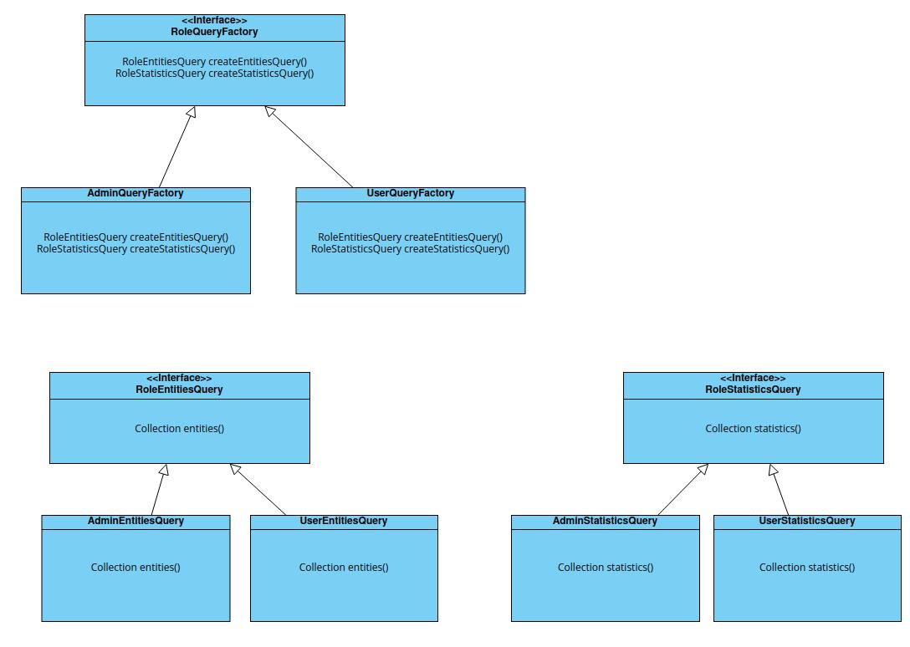

# Abstract factory
Design pattern, which solves the problem of creating entire product families without specifying their concrete classes.

In this example, we can create a different implementation of the query class for different user roles.

